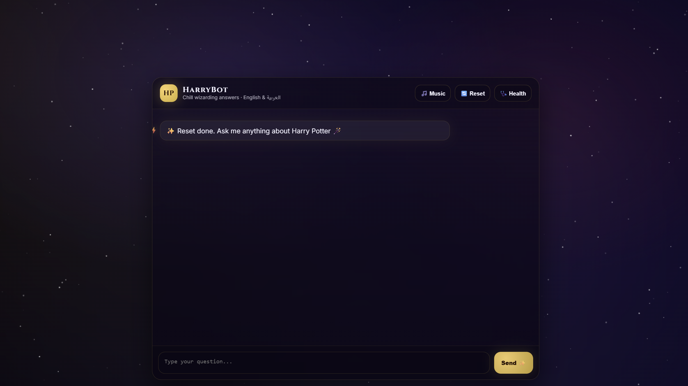
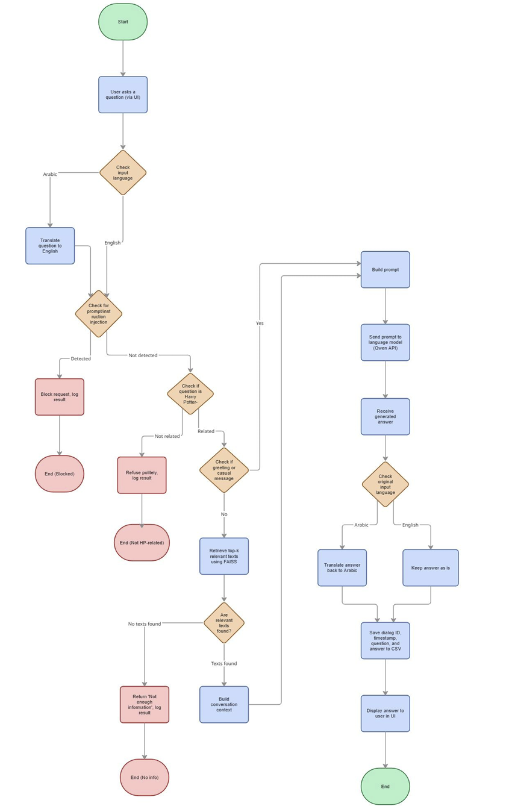

# ⚡ Harry Potter RAG Chatbot (HarryBot)

A secure Retrieval-Augmented Generation (RAG) chatbot built with **FAISS**, **Qwen LLM**, and **Flask API**, supporting both **English and Arabic**, with prompt injection protection and conversational memory.

**Architecture Type:** Secure RAG (Retrieval-Augmented Generation) System

---

## 📸 Demo

### 💬 Chatbot UI


### 🔄 System Architecture


---

## 🚀 Features

- 🔍 FAISS semantic similarity search  
- 🧠 Retrieval-Augmented Generation (RAG)  
- 🤖 Qwen LLM via OpenAI-compatible API  
- 🌍 Arabic ↔ English automatic translation  
- 🛡️ Prompt injection detection  
- 💬 Conversational memory (dialog context)  
- 🗂️ CSV logging with dialog IDs  
- ⚡ Flask REST API backend  
- 🎨 Custom frontend UI  

---

## 🧠 How It Works

1. User sends a question via UI  
2. System detects input language (Arabic or English)  
3. Arabic questions are translated to English  
4. Prompt injection detection is applied  
5. Relevance to Harry Potter domain is checked  
6. FAISS retrieves top-k relevant knowledge chunks  
7. Context is built with conversation history  
8. Prompt is sent to Qwen LLM  
9. Answer is translated back (if needed)  
10. Conversation is logged to CSV  
11. Answer is displayed in UI  

---

## 🏗️ Project Structure

```
harry-potter-rag-chatbot-project/
│
├── backend/
│   ├── api_server.py
│   ├── harrybot_enhanced.py
│   └── config.example.yaml
│
├── frontend/
│   └── index.html
│
├── data/
│   ├── harry_potter_info.txt
│   └── chat_history.csv
│
├── assets/
│   ├── ui.png
│   └── architecture.png
│
├── .env.example
├── requirements
└── README.md
```

---

## ⚙️ Installation & Setup

### 1️⃣ Clone the repository

```bash
git clone https://github.com/Nour0011/harry-potter-rag-chatbot-project.git
cd harry-potter-rag-chatbot-project
```

### 2️⃣ Install dependencies

```bash
pip install -r requirements
```

### 3️⃣ Create your `.env` file

In the root directory, create a file named:

```
.env
```

Add your Qwen API key:

```
QWEN_API_KEY=your_real_api_key_here
```

⚠️ Never commit `.env` to GitHub.

---

### 4️⃣ Create `config.yaml`

Inside `backend/`, copy:

```
config.example.yaml
```

Rename it to:

```
config.yaml
```

Adjust settings if needed.

---

### 5️⃣ Run the API server

```bash
cd backend
python api_server.py
```

Server runs at:

```
http://localhost:5000
```

---

### 6️⃣ Open the frontend

Open:

```
frontend/index.html
```

in your browser.

---

## 🛡️ Security Features

- Prompt injection detection using regex rules  
- Domain restriction (Harry Potter only)  
- Non-HP questions politely refused  
- Environment variable API key protection  
- Sensitive files excluded via `.gitignore`  

---

## 📊 Technologies Used

- Python  
- Flask  
- FAISS  
- SentenceTransformers (E5-large-v2)  
- Qwen LLM (OpenAI-compatible API)  
- HTML/CSS/JS frontend  
- python-dotenv  
- YAML configuration  

---

## 🌍 Language Support

- English  
- Arabic  
- Automatic bidirectional translation  

---

## 🧩 API Endpoints

| Method | Endpoint      | Description              |
|--------|--------------|--------------------------|
| POST   | /api/chat    | Send a question          |
| POST   | /api/reset   | Reset conversation       |
| GET    | /api/stats   | Get statistics           |
| GET    | /api/health  | Health check             |

---

## 📌 Why This Project?

This project demonstrates:

- Practical RAG implementation  
- Secure LLM integration  
- Multilingual NLP pipeline  
- Backend + Frontend integration  
- Real-world AI system architecture  
- Production-style configuration handling  

This project simulates a production-ready AI chatbot system with secure configuration management, multilingual NLP handling, and domain-restricted retrieval logic.

---

## 🎯 Future Improvements

- Docker deployment  
- Vector database upgrade (Pinecone / Milvus)  
- Authentication layer  
- Cloud deployment  
- Model switching support  

---

## 👩‍💻 Author

**Nour Al Dakkak**  
AI Engineering Student  
Passionate about AI systems, automation, and secure LLM applications.

---

## ⭐ If you found this project useful

Give it a star ⭐ on GitHub!
